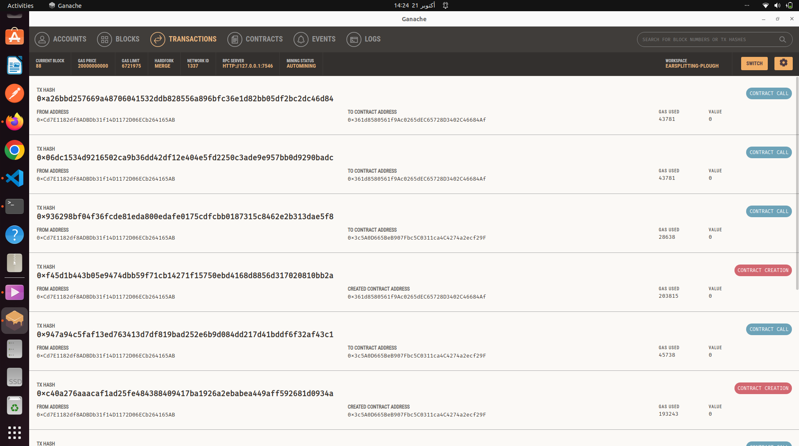
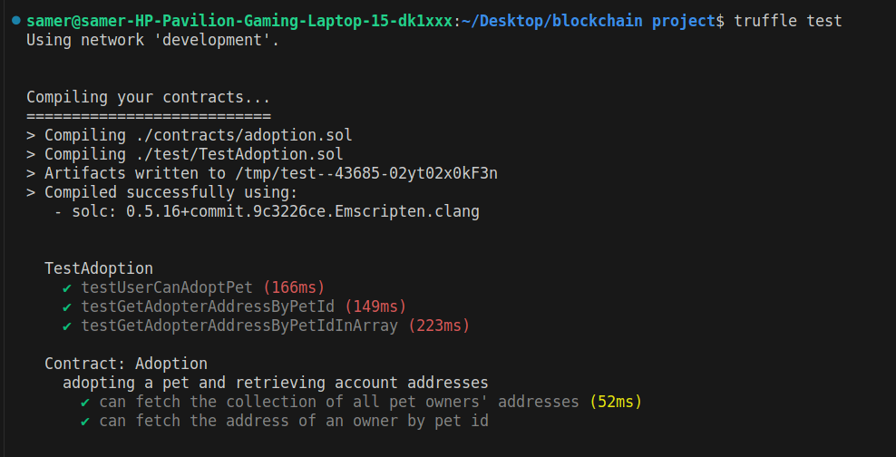
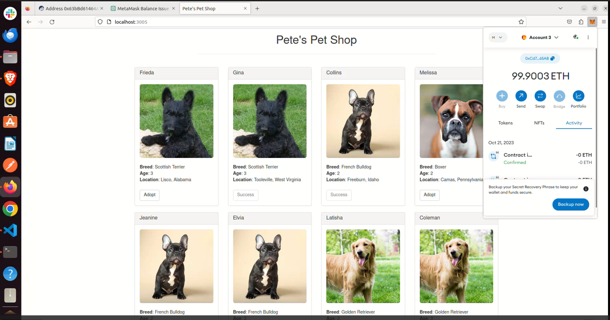
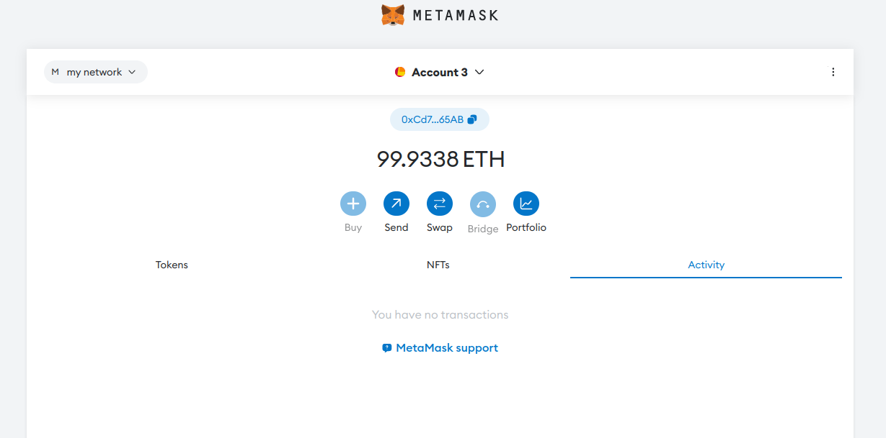

# Pet Shop Truffle Suite Project

## Introduction

This repository contains the Pet Shop project, a classic introductory tutorial provided by the [Truffle Suite](https://www.trufflesuite.com/). It's a decentralized application (dApp) that demonstrates the basics of creating and deploying Ethereum-based smart contracts using the Truffle framework.

In this dApp, users can adopt a pet, with each pet represented as a unique entity on the Ethereum blockchain.

## Features

- **Smart Contract Development**: Utilizes Solidity for Ethereum smart contract development.
- **Testing**: Includes test cases written for the smart contract to ensure functionality and reliability.
- **Front-end Integration**: Web3.js is used to integrate the smart contract functions with the front-end, enabling user interaction.
- **Local Blockchain**: Uses Ganache as a personal Ethereum blockchain for development and testing purposes.

## Setup & Installation

1. **Prerequisites**: Ensure you have [Node.js](https://nodejs.org/) and npm installed.
2. **Truffle & Ganache**: Install [Truffle](https://www.trufflesuite.com/truffle) and [Ganache](https://www.trufflesuite.com/ganache).
   ```bash
   npm install -g truffle
# Setup Instructions for the dApp

## Clone the Repository:

```bash
git clone [repo url ]
cd [pet shop
```
# Install Dependencies

```bash
npm install
```

## Start Ganache

1. Launch Ganache and ensure it's running on the appropriate port (e.g., 7546).


## Compile & Migrate Contracts

```bash
truffle test
truffle compile
truffle migrate
```


## Run the dApp

```bash
npm run dev
```

This will start a local development server, and the dApp will be available at [http://localhost:3000](http://localhost:3000) (or the port you've configured).



## Usage

Once the dApp is running:

- Ensure you have an Ethereum wallet like MetaMask installed and connected to the Ganache network.
- Visit the provided localhost URL.
- Browse the available pets.
- Adopt pets using your Ethereum account.
- Confirm transactions using MetaMask.




## Contribution

Feel free to fork this repository, submit issues, or provide pull requests. Contributions are welcome!

## License

This project is licensed under the MIT License. See the [LICENSE](LICENSE) file for details.

